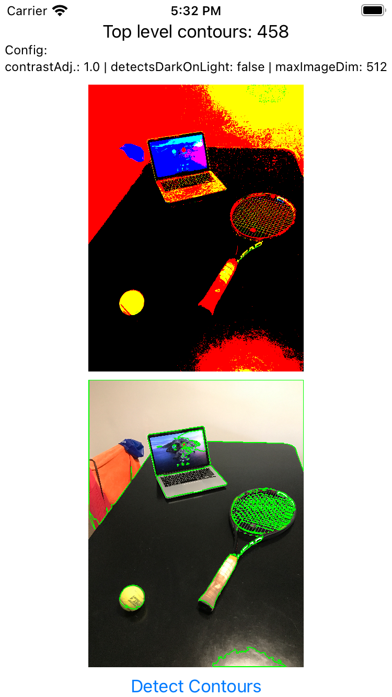
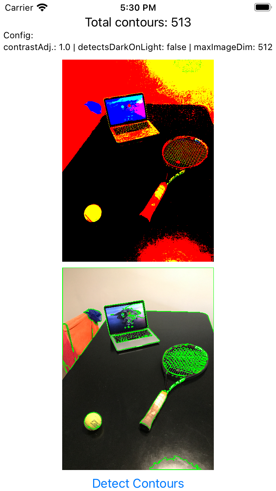
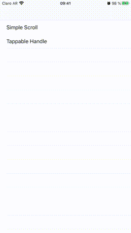

# iOS Lab
This repository's goal is to serve as a place to collect POCs and other small projects used to learn, investigate and experiment in areas related to iOS Development such as: UI, Networking, Persistency, AR, ML, Computer Vision, etcetera.

#### Table Of Contents
**[AI](#ai)** 
**[Audio](#audio)** 
**[Bluetooth LE (BLE)](#bluetooth-le)** 
**[Computer Vision](#computer-vision)** 
**[UI](#ui)** 
**[SwiftUI](#swiftui)** 

## AI

### Object Detection
These projects provide a set of models to detect either COCO or fashion specific objects, each one using their respective formats (CoreML or TFLite) as well as their specific frameworks.

[**CoreML Object Detector**](./ai/objects-detection/ObjectsDetector):  
This project combines CoreML and computer vision (Vision) framworks with the provided models (Yolov3 and our own custom COCO detector) to detect 80 different objects.

[**TFLite based Oject Detector**](./ai/objects-detection/TFLite):
This project is the equivalent of the CoreML based project mentioned above, although using the [TFLite Framework](https://www.tensorflow.org/lite) and model files in the required .tflite format.

## Audio

### Opus
[**Opus Decoding**](./audio/opus-decoding/OpusDecoding): 
This projects uses the [Swift Opus](https://github.com/alta/swift-opus) library (a Swift wrapper around the c opus library) to decode an opus file into a .caf file and then plays that .caf file.

## Bluetooth LE
[**BLE File Transfer**](./ble/ble-file-transfer):  
A project based on Apple's CoreBluetooth sample project shows how to transfer a binary (audio in particular) file using BLE

[**BLE File Audio File (ogg) Transfer + FFmpegKit Integration**](./ble/ble-file-transfer-ffmpeg):
This is a variant of the previous mentioned project. It includes 2 external dependencies:
- [FFmpegKit](https://github.com/tanersener/ffmpeg-kit/tree/development): to convert the .ogg container to Apple's own [Core Audio Format (CAF)](https://en.wikipedia.org/wiki/Core_Audio_Format)
- [FDWaveformView](https://github.com/fulldecent/FDWaveformView): Used to show the audio's waveform after it has been converted form ogg to caf 

## Computer Vision

### Object's outline detection
[**Contour Detector**](./cv/contour-detection/ContourDetector):  
This project leverages the use of the [VNDetectContoursRequest](https://developer.apple.com/documentation/vision/vndetectcontoursrequest) available in the [Vision Framework](https://developer.apple.com/documentation/vision) in iOS Version 14+.

Screenshots:
Black & White prefilter | Color Saturation prefilter
:----------------------:|:---------------------------:
 | 
 | 

## UI

### UICollectionView

#### [Nested CollectionView POC](./ui/uicollectionview/NestedCollectionViewPOC)  
A small project created to experiment with having a main vertical CollectionView with sections. The sections can contain either another, horizontal, collection view, or a grid of cells in a 2 column vertical layout.

#### [CollectionView Prefetch Data example](./ui/uicollectionview/PrefetchExample)  
The [Prefetching Collection View Data](https://developer.apple.com/documentation/uikit/uicollectionviewdatasourceprefetching/prefetching_collection_view_data) example provided by Apple, with additional log messages to better ilustrate/understand the prefetching logic. 

#### [CollectionView CompositionalLayout sample](./ui/uicollectionview/CompositionalLayout/PhotoAlbums%20-%20IBPCollectionViewCompositionalLayout/)  
This RW tutorial on CompositionalLayout:  
https://www.raywenderlich.com/5436806-modern-collection-views-with-compositional-layouts

Adapted to use [IBPCollectionViewCompositionalLayout](https://github.com/kishikawakatsumi/IBPCollectionViewCompositionalLayout) and [DiffableDataSources](https://github.com/ra1028/DiffableDataSources). Both backports from iOS 13 to iOS 12 (also work on iOS 11)

Tested using:
XCode 11.6 (11E708)
Verified on Simulator with iOS 12.0 and 13.6 and iPhone 7 Plus with 13.1

### Misc
[**Tray-View examples**](./ui/tray-view/TrayViewSamples):  
A project showing different alternatives to show a tray, slidable view that can be presented (or dismissed) by scrolling up (or down) as shown next.

[**Camera Custom Overlay**](./ui/camera/custom-overlay): 
A project showing how to create a custom overlay view for the camera when using `UIImagePickerController` with `.camera` as the `.sourceType`. 

## SwiftUI

### Core Data
[**Bookworm**](./swiftui/Bookworm):  
A sample application that shows a basic integration between SwiftUI and Core Data. Based in [this tutorial](https://www.hackingwithswift.com/books/ios-swiftui/bookworm-introduction) from Hacking with Swift

### Camera
[**SwiftUICamera**](./swiftui/SwiftUICamera):  
An application that shows how to access the camera using SwiftUI + Combine. Based on the [following tutorial](https://www.raywenderlich.com/26244793-building-a-camera-app-with-swiftui-and-combine)

### Misc 
[**StatusBarTest**](./swiftui/StatusBarTest):  
A sandbox project used to test different alternatives to show/hide the status bar on SwiftUI applications targeting iOS 14+. 
IMPORTANT: Due to the heterogeneous solutions for implementing the desired functionality we opted to go with updating the min. target to iOS 15 at the time of the creation of this project, the code in this test shows one alternative to solve the problem for iOS 14 (not without drawbacks).
